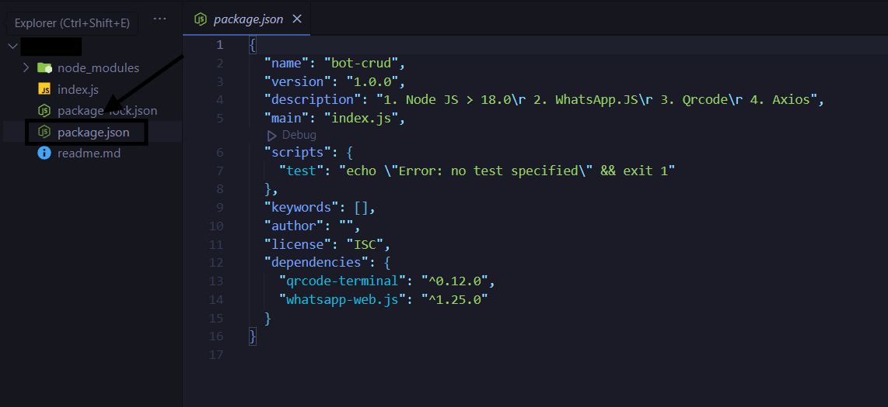
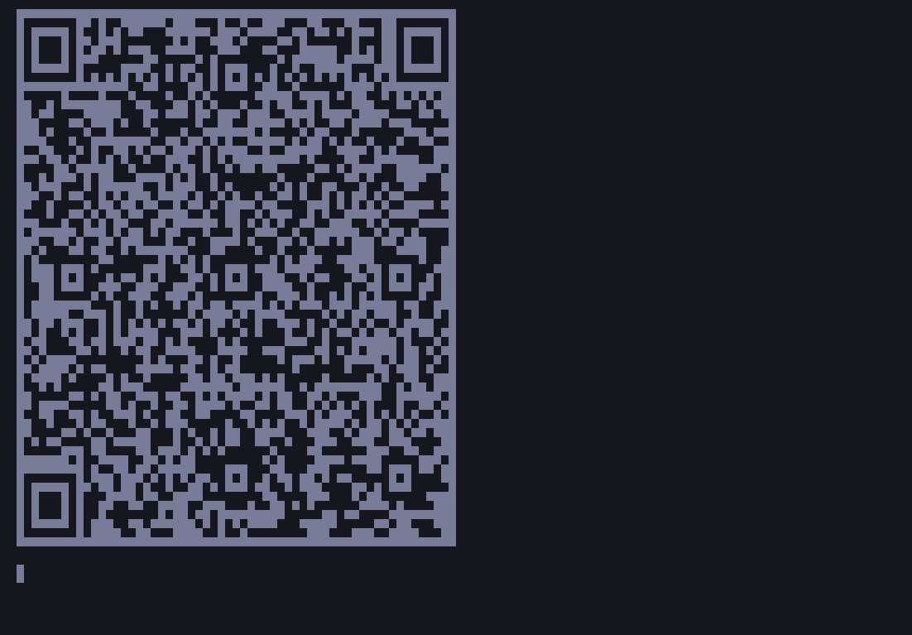
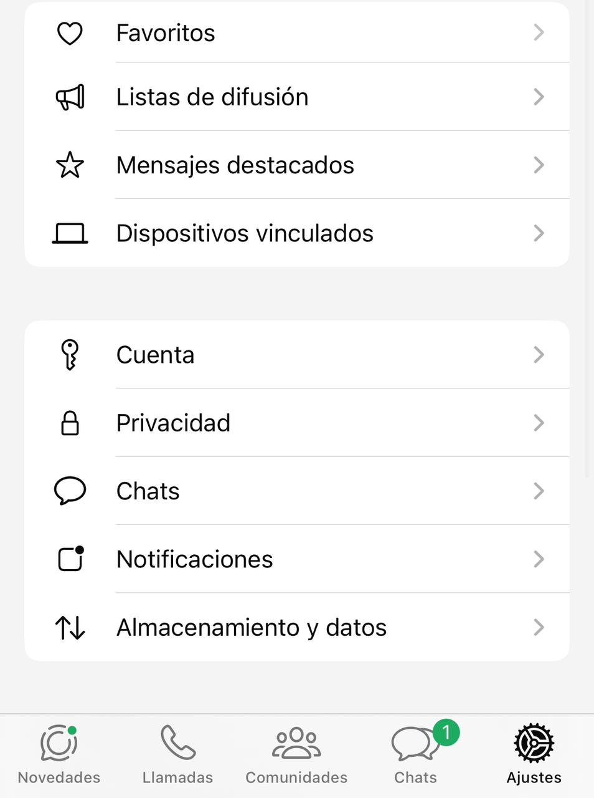
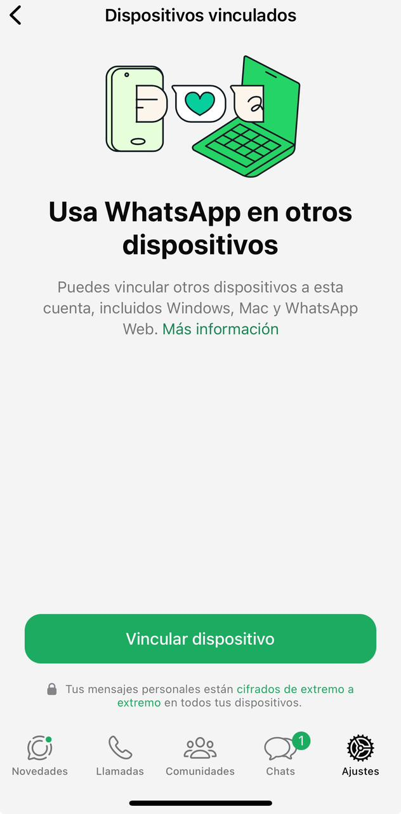
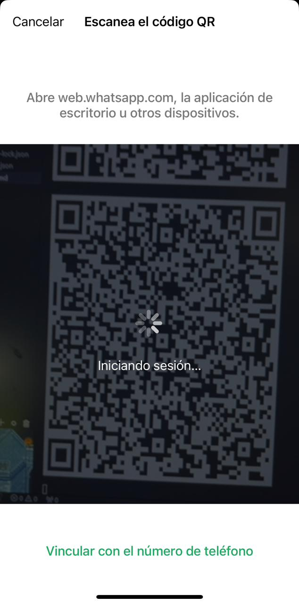
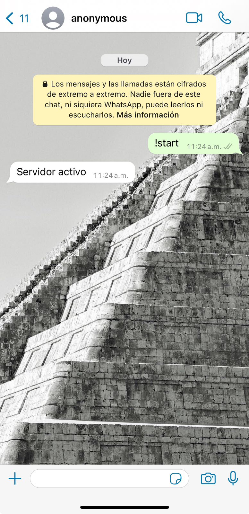

# Creacion de un bot de WhatsApp CRUD

### REQUISITOS
1. Node JS > 18.0
2. WhatsApp.JS
3. Qrcode
4. Axios

#### Lo primero que debemos hacer es crear una carpeta donde tendremos el bot, y dentro de esta iniciaremos el proyecto ejecutando en consola:
```javascript
npm init
```
#### y te hara una serie de preguntas sobre el proyecto, si desea pasar este dato, solo ejecuta el siguiente comando y pondra valores por defecto:
```javascript
npm init -y
```

#### Ahora ya podemos crear un proyecto e instalar librerias usando node, ejecutamos npm install whatsapp-web.js para instalar la libreria que necesitamos:
```javascript
npm install whatsapp-web.js
```
#### Tambien instalar lo siguiente:
```javascript
npm install qrcode-terminal
```

#### con esto podremos crear nuestro bot de WhatsApp, ahora crearemos un archivo llamado *index.js* y en este escribiremos esto:
```javascript
const { Client } = require('whatsapp-web.js');
const qrcode = require('qrcode-terminal');

const client = new Client();

client.on('ready', () => {
    //si escaneamos el QR nos mostrara esto en consola.
    console.log('SERVIDOR EN LINEA 🛡️');
});

client.on('qr', qr => {
    qrcode.generate(qr, {small: true});
});

client.initialize();

```
#### Ahora para ver que esto funciona, despues del codigo anterior crearemos un comando que nos responda *"Servidor activo"* o lo que quieras poner:
```javascript
client.on('message_create', message => {
	if (message.body === '!start') {
		// al escribir !start en el chat de nuestro bot este nos respondera con "Servidor activo"
		client.sendMessage(message.from, 'Servidor activo');
	}
});

```
#### Ahora te preguntaras; ¿como PU*# corremos el proyecto?, para esto iremos al archivo *package.json*


#### ahora dentro de scripts escribiremos esto un comando, en caso de que haya algo como esto:
```javascript
  "scripts": {
    "test": "echo \"Error: no test specified\" && exit 1"
  },
```
#### puedes eliminarlo y escribir solo este comando que nos ayudara a iniciar nuestro bot:
```javascript
  "scripts": {
   "start": "node ."
  },
```
#### el resultado puede verse algo asi:
```javascript
{
  "name": "bot-crud",
  "version": "1.0.0",
  "description": "1. Node JS > 18.0\r 2. WhatsApp.JS\r 3. Qrcode\r 4. Axios",
  "main": "index.js",
  "scripts": {
   "start": "node ."
  },
  "keywords": [],
  "author": "",
  "license": "ISC",
  "dependencies": {
    "qrcode-terminal": "^0.12.0",
    "whatsapp-web.js": "^1.25.0"
  }
}
```
### Ahora solo corremos nuestro bot ejecutando el comando en una nueva terminal de VSCODE:
```javascript
npm start
```

#### Si hicimos todo bien hasta aqui, nos saldra algo como esto


#### ahora deberas escanear este QR desde un numero de telefono que tenga WhatsApp, para esto deberas ir a la aplicacion de whatsapp
#### y entras a -> *ajustes* -> luego veras algo que dice *DISPOSITIVOS VINCULADOS* ENTRAS Y VERAS UN BOTON QUE DICE *VINCULAR DISPOSITIVO*
#### Le das clic y te saldra un apartado donde deveras apuntar la camara al QR. Dejo imagenes de referencia.




#### Si hiciste esto bien y vas a la consola, veremos un mensaje de exito: *SERVIDOR EN LINEA🛡️*


#### Ahora, solo debemos de probar nuestro bot, para ello vamos a usar el siguiente comando que anteriormente definimos en nuestro codigo(en caso que hayas usado algun otro, puedes escribirlo), ojo, escribelo en el chat de tu bot de whatsapp no en la consola:
```javascript
!start
```
### El bot deberia de respondernos asi:



#### ahora una breve explicacion: cuando nosotros hacemos el *client.on* estamos usando un metodo, este metodo tine varios tipos, por lo cual nosotros usaremos el de *message_create* dentro del metodo, aqui le decimos que usaremos el metodo el cual creara un mensaje y nos respondera
```javascript
client.on('message_create', message => {
  
});
```

#### ahora cuando nosotros encendemos nuestro servidor, este estara en uso, pero, ¿como hacemos que este metodo este a la escucha de mensajes entrantes?; vale, es ahi donde entra una pequeña validacion donde le decimos que si el cuerpo del mensaje entrante contiene la palabra !start y es igual, nos responda, de lo contrario, ignorara el mensaje.

```javascript
	if (message.body === '!start') {
		// al escribir !start en el chat de nuestro bot este nos respondera con "Servidor activo"
		client.sendMessage(message.from, 'Servidor activo');
	}
```
#### ahoras por que *client*, ok, *client*  es un objeto o  una instancia de su clase principal *Client* si, es una clase, esta contiene metodos, entonces para acceder a las propiedades de este y usar sus metodos, usamos y creamos una instancia
```javascript
const client = new Client();
```
#### donde **client** sera el objeto que usaremos para acceder a sus metodos y propiedades de la clase principal.

**Curso en proceso, continuara...**